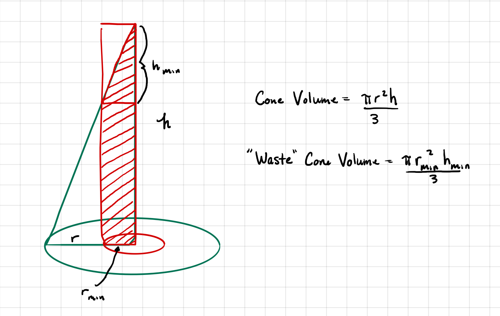

```{r setup, include=FALSE}
knitr::opts_chunk$set(echo = TRUE, warning = FALSE, results = "hold", message = FALSE)
options(reticulate.repl.quiet = TRUE)
```

## Modeling Board Feet of Lumber

In the homework, you were essentially asked to create three different models for board feet of lumber based on the diameter of the tree at waist height. The first two of the models were specified by the book; the third model was up to you to create. For each model, the appropriate scaling relationship needed to be derived based on assumptions. After that, each model needed to be plotted and assessed for fit. Finally, you were asked to choose which model was best based on your analyses.

## Model One --- Fixed Tree Height
In this model, you were told to assume that all trees are essentially fixed height cylinders. Mathematically, we need the volume of the cylinder to act as an approximation to board feet of lumber. Thus,
$$board\,feet \propto V_{cyl.} = \pi r^2 h.$$ 

And the volume of tree $i$ having radius $r_i$ is $V_i = \pi r_i^2 h$, if height $h$ is fixed. If we let calculate the ratio of the volume of two trees, we get
$$\frac{V_1}{V_0} = \frac{\pi r_1^2 h}{\pi r_0^2 h} =  \frac{r_1^2 }{r_0^2}.$$
Solving the equation for $V_1$ gives $V_1 = \frac{V_0}{r_0^2}r_1^2 \propto \beta r_1^2$. In other words, the volume (board feet) of a tree in this model is proportional to the squared radius, and also proportional to the squared diameter.

### Fitting the Model
We can simply use the `lm()` function in R to fit this model. Remember, there is no intercept in the model, so wemust specify this in the function call. Before we can fit a model, we need to enter the data and visualize it.
```{r lumber}
lumber <- data.frame(
  "diameter" = c(17,19,20,23,25,28,32,38,39,41),
  "board.ft" = c(19,25,32,57,71,113,123,252,259,294)
)

plot(lumber)
```

Fitting the model is fairly simple. Note the use of the `I()` function in the model. We can plot the model to see the diagnostics after fitting. 

```{r Model1}
m1 <- lm( board.ft ~ I(diameter^2) - 1, data = lumber)
summary(m1)
plot(m1)
```

The model using the squared-diameter fits very well. For the model $R^2=$ `r round(summary(m1)$adj.r.squared,3)` with AIC = `r round(AIC(m1),1)`. The diagnostic plots look fairly reasonable for the model; there are a few minor red flags but nothing drastic.

## Model Two --- Proportional Tree Height

The second model has a slight modification from the first model. Now we assume that $h_i \propto c r_i$, therefore
$$\frac{V_1}{V_0} = \frac{\pi r_1^2 h_1}{\pi r_0^2 h_0} =  \frac{\pi r_1^2 c r_1}{\pi r_0^2 c r_0} = \frac{r_1^3 }{r_0^3}.$$
Again, now solving for $V_1$ yields $V_1 = \frac{V_0}{r_0^3}r_1^3 \propto \beta r_1^3,$ i.e., the volume of the tree is now proportional to the cubed radius, as well as the diameter.

### Fitting the Model

We employ the same code as for the first model, with the slight modification of cubing the diameter in the fitting process.

```{r Model2}
m2 <- lm( board.ft ~ I(diameter^3) - 1, data = lumber)
summary(m2)
plot(m2)
```

The model using the cubed-diameter seems to fit even better. For the model $R^2=$ `r round(summary(m2)$adj.r.squared,3)` with AIC = `r round(AIC(m2),1)`. The diagnostic plots look better for this model as well; there are a few minor red flags but nothing drastic.

## Model 3 --- A Hollow, Truncated Cone

For my third model, I chose to think of a tree as being a very narrow cone. Once the top of the cone becomes too narrow, the wood is no longer useful. Likewise, at some radius, $r_{min}$, the tree no long has usable board feet. Think of cedars trees from the Northwest which are largely hollow once they reach a certain size. 



The above figure shows how I thought of the tree, with the relevant measures. How can we model this?

The answer is slightly trickier than our previous models. I chose to think of the volume of the full tree, $V_t = \frac{1}{3} \pi r^2 h$, the volume of the *cylinder* at the center, $V_c = \pi r_{min}^2h$. If we take $V_t - V_c$, we have subtracted out too much volume (see the negative space at the top left of the figure). How much volume is necessary to add back in? Well, if we add back in the cylinder at the top given by $V_{top} = \pi r_{min}^2 h_{min}$, we've added back in too much, but we can see we need to subtract the cone given by $V_{min} = \frac{1}{3} \pi r_{min}^2 h_{min}$ to fix this. The difference $V_{top} - V_{min} = \frac{1}{3} \pi r_{min}^2 h_{min} = 2 V_{min}$. So now we now the volume of board feet is given by

$$board\,feet = V_t - V_c + 2 V_{min}.$$
Using similarity we can further simplify the model. Specifically, using the relation $k = \frac{r}{r_{min}} = \frac{h}{h_{min}}$, we get $V_t = \frac{1}{3} \pi r^2 h = \frac{1}{3} k^3 \pi r_{min}^2 h_{min} = k^3 V_{min}$ and $V_c = \pi r_{min}^2h = k \pi r_{min}^2h_{min} = 3kV_{min}$. Our formula for board feet now becomes

$$board\,feet  = V_t - V_c + 2 V_{min} \\
  = V_{min}(k^3 - 3k+2) \\
  = V_{min}\left(\left(\frac{d}{d_{min}}\right)^3 - 3\frac{d}{d_{min}}+2\right)$$

We can now attempt to model board feet with this relationship using the diameter $d$ of the tree. Note however, there is a *specific* relationship between the coefficients in our model. To see this, assume

$$ board\, feet = \beta_2 d^3 - \beta_1 d + \beta_0.$$
It is easy to see that $\beta_0 = 2 V_{min}$. For the other coefficients, $\beta_1 = \frac{3 V_{min}}{d_{min}} = \frac{3}{2 d_{min}}\beta_0$ and $\beta_2 = \frac{V_{min}}{d_{min}^3} = \frac{1}{2 d_{min}^3} \beta_0.$ Substituting these back into our equation yields

$$board\, feet = \beta_0\left(\frac{d^3}{2 d_{min}^3} - \frac{3 d}{2 d_{min}} + 1\right),$$
which could be more simply thought of as $board\,feet=\beta_0 f(d,d_{min}).$ Obviously, we are missing one critical piece of information for fitting this model. What is it?

### Fitting the Model

Hopefully you figured out the missing piece of the puzzle is $d_{min}.$ For the purposes of fitting our model, we will just assume a value of $d_min$. Here is the code for fitting the model assuming $d_{min} = 4.$ Note that we have to transform $d$ using the RHS of the equation for board feet.

```{r}
lumber2 <- lumber
dm <- 4 #assumed value of d_min
lumber2$trans <- with(lumber, diameter^3/(2*dm^3) - 3*diameter/(2*dm) + 1) #transform the diameter

summary(mm <- lm(board.ft ~ trans - 1 , data = lumber2)) #fit the model
plot(mm)
```

As with our previous models, the fit is quite good. For the model where we assume $d_{min} = 4$, $R^2=$ `r round(summary(mm)$adj.r.squared,3)` with AIC = `r round(AIC(mm),1)`. The diagnostics are quite comparable to those of our other two models.

## Model Comparison/Selection


Now that we have three functioning models for board feet, we need to choose which one is best. First, let's plot the models with the data to visually compare the results. 

```{r}

plot(lumber)
predictIt <- data.frame(diameter = seq(17,41,len=100)) 
### why did I do this instead of just getting fitted values?
lines(predictIt$diameter,predict(m1, predictIt), col = "red")
lines(predictIt$diameter,predict(m2, predictIt), col = "blue")
bf <- function(d,Vm,dm) Vm/dm^3 * d^3 - 3*Vm/dm*d + 2*Vm
lines(predictIt$diameter, bf(predictIt$diameter,coef(mm)/2,dm), col="green")
```
From the plots, it looks like model 2 and 3 are better than model 1. Let's use Akaike's Information Criterion (AIC) to compare between our models. Remember, lower values of AIC are better.

```{r}
AIC(m1,m2,mm)
```

Based on AIC values, it looks like model 1 is the winner, but it narrowly beats model 3. But remember, we just assumed $d_{min} = 4$ for the third model. What happens if we try to choose a better value of $d_{min}$? Let's do this by looping over various values $d_{min}$ and comparing AIC values. Afterwards, we can plot the values and look for an optimum.

```{r}
AICvals <- c()
dVals <- seq(0.1,10,by=0.1)
for(dmin in dVals){
  dm <- dmin
  lumber2$trans <- with(lumber, diameter^3/(2*dm^3) - 3*diameter/(2*dm) + 1) 
  val <- AIC(mm <- lm(board.ft ~ trans - 1 , data = lumber2))
  AICvals <- c(AICvals,val)
}

#Plot the values to see if there is an optimum
plot(dVals,AICvals,type="l", xlab = expression(d[min]), ylab="AIC")
```

Our plot clearly suggests that the best value $d_{min}$ is simply $d_{min} = 0$, at which point our more complex model 3 converges back to the simpler model based on the cubed-diameter of a tree! Thus, in the end, it looks like model 2 would be our choice based on something like AIC. Does that mean we have to choose this model?


