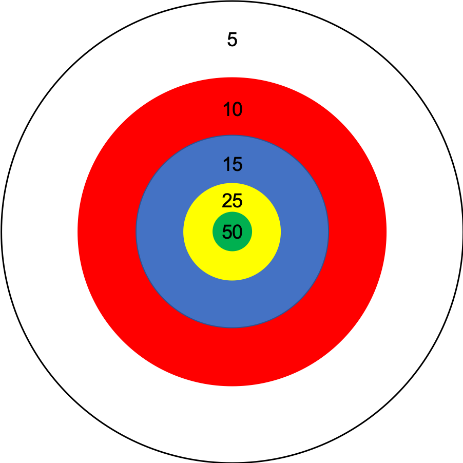
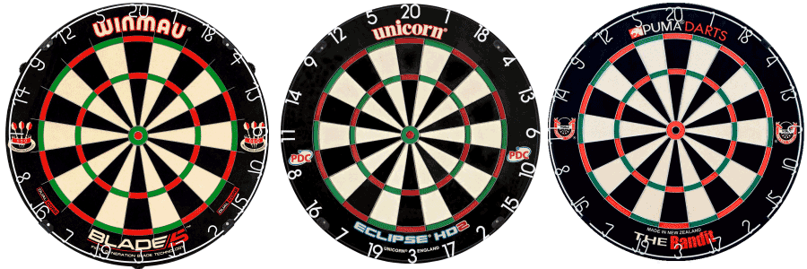

# Modeling Darts

The problem in the book asks you to model a game of darts using a hypothetical board that is simply concentric circles. The boad is laid out in the following manner:

```{r Hypothetical Board, echo=F}
simpleBoard <- data.frame(color = c("Bullseye", "Yellow", "Blue", "Red", "White"), Thickness = c(1,1.5,2.5,3.0,4.0), 
                          Points = c(50,25,15,10,5))
knitr::kable(simpleBoard)
```

which means the board looks like this: 

{width=400px}

You are then asked to determine the mean value of throwing five darts if you assume some distribution of how the darts hit the board. The obvious (?) choice of would be to use a random normal centered on the $(x,y)$ target with some amount of error $\sigma$. Let's use this and find the mean.

```{r Five Darts}

values  <- stepfun(c(1,2.5,5,8,12), c(50,25,15,10,5,0))

plot(seq(0,13,by=0.01), values(seq(0,13,by=0.01)), type = "l", xlab = "Radius", ylab= "Score")

### Make a function to get the point value
# x, y are the target coordinates
# error is the s.d. of the normal distribution
score <- function(x, y, error){
   x <- rnorm(1, mean = x, sd = error)
   y <- rnorm(1, mean = y, sd = error)
   r <- (x^2 + y^2)^0.5
   values(r)
}

#default (x,y) = (0,0), error = 1 inch
throwFive <- function(x = 0, y = 0, error = 1) mean(vals <<- replicate(5,score(x = x, y = y, error = error)))
```

The `throwFive()` function will return mean value from throwing five darts at a specified target. Note that if we assume our accuracy is the same in both directions (axes), we can easily see that the only thing that matter is the *radius* at which we aim. Let's try plotting the mean of five darts, replicated 1000x, thrown at various target radii.

```{r}
r0 <- replicate(1000,throwFive())
mean(r0)

#now create a function to do this across many radii
mean1k <- function(radius, error = 1, mean.only = TRUE, qtile = c(0.05,0.95)){
  scores <- sapply(radius, function(z) replicate(1000, throwFive(x = z, error = error)))
  if(mean.only) return(colMeans(scores))
  out <- data.frame(radius = radius, mean = colMeans(scores), median = apply(scores, 2, median), 
                    lower = apply(scores,2, quantile, qtile[1]), upper = apply(scores,2, quantile, qtile[2]))
  out
}
```

```{r}
diffRadii <- mean1k(seq(0,12,by=0.1), mean.only = F)
```

```{r}
library(ggplot2)
g <- ggplot(diffRadii, aes(x=radius, y=mean, ymax=upper, ymin=lower))

g + geom_ribbon(aes(fill="gray"), alpha = 0.2)  + geom_line(aes(col = "red")) + geom_line(aes(y = median, col = "blue"), lty=2)+ theme_bw() + xlab("Target Distance from Origin (in.)") + ylab("Score") + scale_color_manual(name = 'Measure', guide = 'legend', values = c('red' = 'red', 'blue' = 'blue'), labels = c('mean','median')) + scale_fill_identity(name = "95% CI", labels = NULL , guide = 'legend') + ggtitle("Throwing Five Darts with Error = 1")
```


With the error being set at 1, we see the mean and median steadily decrease as you aim further toward the outside. Let's rerun the data and see what happens when set the error to be quite a bit larger, say 3.

```{r}
diffRadii3 <- mean1k(seq(0,12,by=0.1), mean.only = F, error = 3)

g <- ggplot(diffRadii3, aes(x=radius, y=mean, ymax=upper, ymin=lower))

g + geom_ribbon(aes(fill="gray"), alpha = 0.2)  + geom_line(aes(col = "red")) + geom_line(aes(y = median, col = "blue"), lty=2)+ theme_bw() + xlab("Target Distance from Origin (in.)") + ylab("Score") + scale_color_manual(name = 'Measure', guide = 'legend', values = c('red' = 'red', 'blue' = 'blue'), labels = c('mean','median')) + scale_fill_identity(name = "95% CI", labels = NULL , guide = 'legend') + ggtitle("Throwing Five Darts with Error = 3")
```


Again, we see a similar patter of scores (monotonically decreasing with the distance of the target from the origin). Let's try one last time where the error is large enough that we're getting close to "random noise."

```{r}
diffRadii8 <- mean1k(seq(0,12,by=0.1), mean.only = F, error = 8)

g <- ggplot(diffRadii8, aes(x=radius, y=mean, ymax=upper, ymin=lower))

g + geom_ribbon(aes(fill="gray"), alpha = 0.2)  + geom_line(aes(col = "red")) + geom_line(aes(y = median, col = "blue"), lty=2)+ theme_bw() + xlab("Target Distance from Origin (in.)") + ylab("Score") + scale_color_manual(name = 'Measure', guide = 'legend', values = c('red' = 'red', 'blue' = 'blue'), labels = c('mean','median')) + scale_fill_identity(name = "95% CI", labels = NULL , guide = 'legend') + ggtitle("Throwing Five Darts with Error = 8")
```
While there is a bit of difference between aiming at the bullseye/origin, it is not significantly better than aiming anywhere!!! 

# Playing a Real Game

The second part of the homework asked you to consider a *real* dart board. This time you were asked to calculate the average number of darts to complete a game of either 301 or 501. A standard dartboard is 340mm in diameter (for the scoring surface, 451 total), with an inner bullseye diameter of 12.7mm, outer bullseye diameter of 32mm, the triple ring is at 99--107mm radius, and the double is at 162--170mm radius. There are 20 sectors having values 1--20, i.e., each is 18 degrees. See [here](http://www.darts501.com/Boards.html) for details. 


{width=800px}

## Aiming
Thus we need to create a scoring function for our more complex board. We'll do this using polar coordinates and the radius. First let's write a function that takes a target, adds some error, and returns the spot the dart actually hits.

```{r Aiming Function}

polar <-function(x,y){
  r <- (x^2 + y^2)^0.5
  theta  <- acos(x/r) 
  if(y != 0) theta <- theta*sign(y)
  c(r,theta)
}

polar.inv <- function(r, theta){
  x <- r*cos(theta)
  y <- r*sin(theta)
  c(x,y)
}

badAim <- function(r, theta, error = 4){
  xy <- polar.inv(r, theta)
  xy <- rnorm(2, xy, error)
  c(polar(xy[1],xy[2]))
}

###Verify that function works:

badAim(160, pi/2)
badAim(160, pi/2, error=30)
```
Okay it look like our aiming function is doing it's job properly.

## Scoring
Now we need to construct our virtual dart board so that we can get both targets (with point values) and have an idea of how to return point values for targets hit.

```{r Scoring Function}

##Targets, there are technichally 4*20 + 2 targets, however, one should never 
##target the inner single ring if you want to hit a single, always the larger
##outer single area. We also want to aim for the center of any target.

##for simplicity leave out the bullseye zones for now
targetRadii <- c( "Single" = (162-107)/2, "Double" = 166, "Triple" = 103)
##Center of zones occur every pi/10
targetZones <- seq(-pi, 9*pi/10, by=pi/10)

##Organized in same order as targetZones, i.e. counter-clockwise starting at -pi
pointVals <- c(11,8,16,7,19,3,17,2,15,10,6,13,4,18,1,20,5,12,9,14)

#make 2 tables
pointTable <- data.frame("theta" = targetZones, "zone" = pointVals)
multTable <- data.frame("radius" = targetRadii, "multiplier" = c(1,2,3))

#merge the tables to get the big table and then calculate the score
scoringTable <- merge(pointTable,multTable)
scoringTable$score <- scoringTable$zone * scoringTable$multiplier

### Now we need to have a function to asses point values
getScore <- function(r, theta){
  if(r < 12.7/2) return(50) #double bull
  if(r < 16) return(25) #single bull
  if(r > 170) return(0) #air ball
  theta <- theta + pi/20 #rotate a theta a bit, it makes classifying the zone easier
  z <- theta %/% (pi/10) + 11 #get integer value from 1,21
  zList <- c(11,8,16,7,19,3,17,2,15,10,6,13,4,18,1,20,5,12,9,14,11)
  score <- zList[z]
  mult <- if(r < 99) 1 else if(r < 107) 3 else if(r < 162) 1 else 2
  score*mult
}

getScore(160,pi/2)
getScore(166,pi/2)
getScore(101,pi/2)
getScore(10,pi/2)
getScore(5,pi/2)
```
It looks like the scoring function works correctly.

## Playing a Game

Now that we have both an aiming function and a scoring function, we can play a game of darts! This part is the code to play a game using the standard 301/501 darts rules with a "northern bust." Basically, it's a lot of flow control and counting.

```{r The Game}

### Now we need to throw a game
### and see how many darts it takes
### Variant sets the score you need to get (301 or 501)
### Error is the error (sd) in mm of tossing a dart
### Start.strategy can pick which double to shoot at first, NULL = double bull
game <- function(targets=scoringTable, variant = 301, error = 4, start.strategy = NULL){
  dartCount <- 0
  #need a double to start the game, ideally a double bull
  if(is.null(start.strategy)) targ <- c(0,pi)
  else
  targ <- with(targets, {
               index <- multiplier == 2 & zone == start.strategy
               c(radius[index],theta[index])
  })
  
  isDouble <- FALSE
  while(!isDouble){
    dartCount <- dartCount + 1
    hit <- badAim(targ[1],targ[2], error = error)
    isDouble <- hit[1] < 12.7/2 | (hit[1] <= 170 & hit[1] >= 162)
  }
  
  netScore <- variant - getScore(hit[1], hit[2])
  
  ### if netScore > 62, throw at triple 20 (highest value)
  while(netScore > 62){
    dartCount <- dartCount + 1
    targ <- with(targets, {
      index <- multiplier == 3 & zone == 20
      c(radius[index],theta[index])
    })
    hit <- badAim(targ[1],targ[2], error = error)
    netScore <- netScore - getScore(hit[1], hit[2])
  }
  
  ### now we have to "double out" to finish, the highest double is the 
  ### bullseye, 50 pts; so if we are between >50 but <71, we can try and 
  ### hit a double bullseye to finish
  
  ### Everywhere  < 62 we need to make sure a dart doesn't make us "bust,"
  ### i.e., there is no way to double out, so that dart then doesn't count.
  ### This is a "modified" bust rule because we aren't tracking volleys (it's called
  ### a "northern bust").
  
  
  while(netScore > 50 & netScore < 71){
    dartCount <- dartCount + 1
    targ <- with(targets, {
      index <- multiplier == 1 & zone == netScore - 50
      c(radius[index],theta[index])
    })
    hit <- badAim(targ[1],targ[2], error = error)
    val <-  getScore(hit[1], hit[2]) 
    if(netScore - val < 2) next # "bust" rule
    netScore <- netScore - val
  }
  
  
  ## if we got lucky and hit 50
  while(netScore == 50){
    dartCount <- dartCount + 1
    hit <- badAim(0,pi, error = error)
    val <-  getScore(hit[1], hit[2])
    if(val - netScore == 0) return(c("darts" = dartCount))
    if(netScore - val < 2) next
    netScore <- netScore - val
    
  }
  
  ### once you're below 50 we have to drop to 40 for our next chance
  ### to double out
  
  
  while(netScore > 40){
    
    dartCount <- dartCount + 1
    targ <- with(targets, {
      index <- multiplier == 1 & zone == netScore - 40
      c(radius[index],theta[index])
    })
    hit <- badAim(targ[1],targ[2], error = error)
    val <-  getScore(hit[1], hit[2]) 
    if(netScore - val < 2) next 
    netScore <- netScore - val
  }
  
  ### now we're at the end game
  
  ###if netScore is odd, we must make it even, preferably throwing a one
  getMeOut <- 0 #failsafe
  
  while(netScore != 0 & getMeOut < 1000){
    getMeOut <- getMeOut + 1
    while(netScore %% 2 == 1){
      dartCount <- dartCount + 1
      targ <- with(targets, {
        index <- multiplier == 1 & zone == 1
        c(radius[index],theta[index])
      })
      hit <- badAim(targ[1],targ[2], error = error)
      val <-  getScore(hit[1], hit[2]) 
      if(netScore - val < 2) next 
      netScore <- netScore - val
    }
    
    #throw at the largest even double
    while(netScore %% 2 == 0){
      dartCount <- dartCount + 1
      targ <- with(targets, {
        index <- multiplier == 2 & zone == netScore/2
        c(radius[index],theta[index])
      })
      hit <- badAim(targ[1],targ[2], error = error)
      val <-  getScore(hit[1], hit[2])
      if(netScore - val == 0) return(c("darts" = dartCount))
      if(netScore - val < 2) next
      netScore <- netScore - val
    }
  }
  
  print("Game Failed.")
}

game()
game(start.strategy = 20)
game(error = 31)
game(variant = 501)
```

Alright! It looks like we're ready to use our dart game to answer some questions.

## Mean Performance while Varying Error


First, let's just run a simple game with 1000x with an error = 10. After verifying that works, create a bigger loop that varies the error from 0--50.

```{r Replicated Games}
nDarts <- replicate(1000, game(error = 10))
  
mean1k.game <- function(errlevels, mean.only = TRUE, qtile = c(0.05,0.95)){
  nDarts <- sapply(errlevels, function(z) replicate(1000, game(error = z)))
  if(mean.only) return(colMeans(nDarts))
  out <- data.frame(error = errlevels, mean = colMeans(nDarts), median = apply(nDarts, 2, median), 
                    lower = apply(nDarts,2, quantile, qtile[1]), upper = apply(nDarts,2, quantile, qtile[2]))
  out
}

Games <- mean1k.game(0:50, mean.only = F)
```

Everything seemed to work well. Let's take a look at the plot of the simulation data:

```{r Plotting Performance}
g <- ggplot(Games, aes(x=error, y=mean, ymax=upper, ymin=lower))

g + geom_ribbon(aes(fill="gray"), alpha = 0.2)  + geom_line(aes(col = "red")) + geom_line(aes(y = median, col = "blue"), lty=2)+ theme_bw() + xlab("Standard Deviation of Accuracy (mm.)") + ylab("Number of Darts") + scale_color_manual(name = 'Measure', guide = 'legend', values = c('red' = 'red', 'blue' = 'blue'), labels = c('mean','median')) + scale_fill_identity(name = "95% CI", labels = NULL , guide = 'legend') + ggtitle("Playing a Game of 301")
```

As expected, the worse your aim, the longer it takes to complete a game of darts. At some point, you should just give up! 

## BONUS: Different Starting Strategy

The default starting strategy is to shoot for the double bull because it scores the most points. However, for people with worse aim, we might expect there to be a benefit of shooting at the double ring becuase of the difference in area (i.e., the area of the double bull is `r round(pi*12.7^2/4,3)` mm^2^ while a double segment has area `r round(pi/20*(170^2-162^2),3)` mm^2^). Let's see if we can this difference is realized. To do this, we'll have one game with the default starting strategy and the other shooting at the double 20 and take the difference in darts.

```{r Difference in Strategy}
mean1k.diff <- function(errlevels, mean.only = TRUE, qtile = c(0.05,0.95)){
  nDarts <- sapply(errlevels, function(z) replicate(1000, game(error = z) - game(error = z, start.strategy = 20)))
  if(mean.only) return(colMeans(nDarts))
  out <- data.frame(error = errlevels, mean = colMeans(nDarts), median = apply(nDarts, 2, median), 
                    lower = apply(nDarts,2, quantile, qtile[1]), upper = apply(nDarts,2, quantile, qtile[2]))
  out
}

Strats <- mean1k.diff(0:50, mean.only = F)
```

Now plot the results:

```{r Plotting Differences}
g <- ggplot(Strats, aes(x=error, y=mean, ymax=upper, ymin=lower))

g + geom_ribbon(aes(fill="gray"), alpha = 0.2)  + geom_line(aes(col = "red")) + geom_line(aes(y = median, col = "blue"), lty=2)+ theme_bw() + xlab("Standard Deviation of Accuracy (mm.)") + ylab("Difference in Number of Darts") + scale_color_manual(name = 'Measure', guide = 'legend', values = c('red' = 'red', 'blue' = 'blue'), labels = c('mean','median')) + scale_fill_identity(name = "95% CI", labels = NULL , guide = 'legend') + ggtitle("Difference in Strategies")
```

Does the plot above fit the hypothesis? Why or why not?