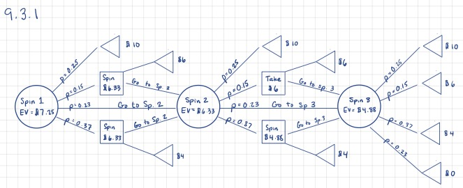
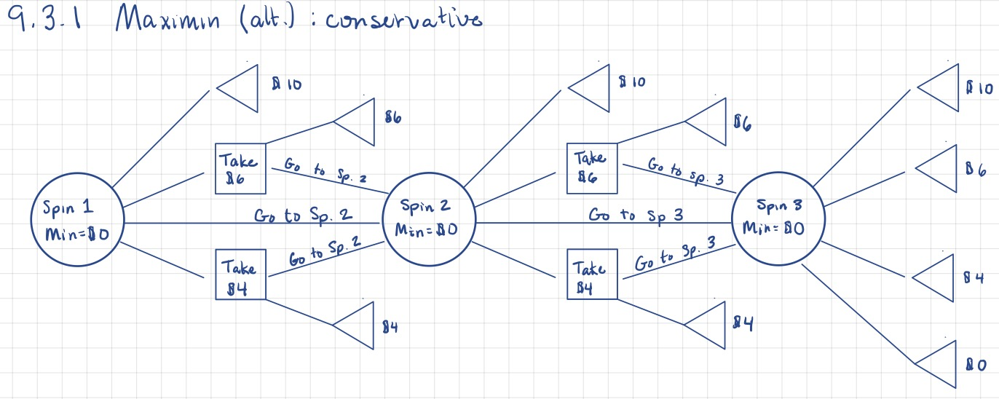
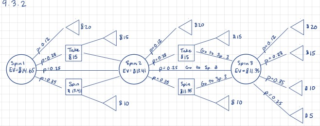
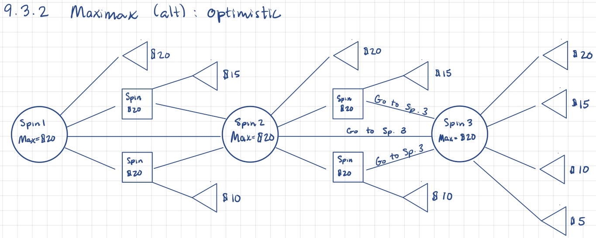
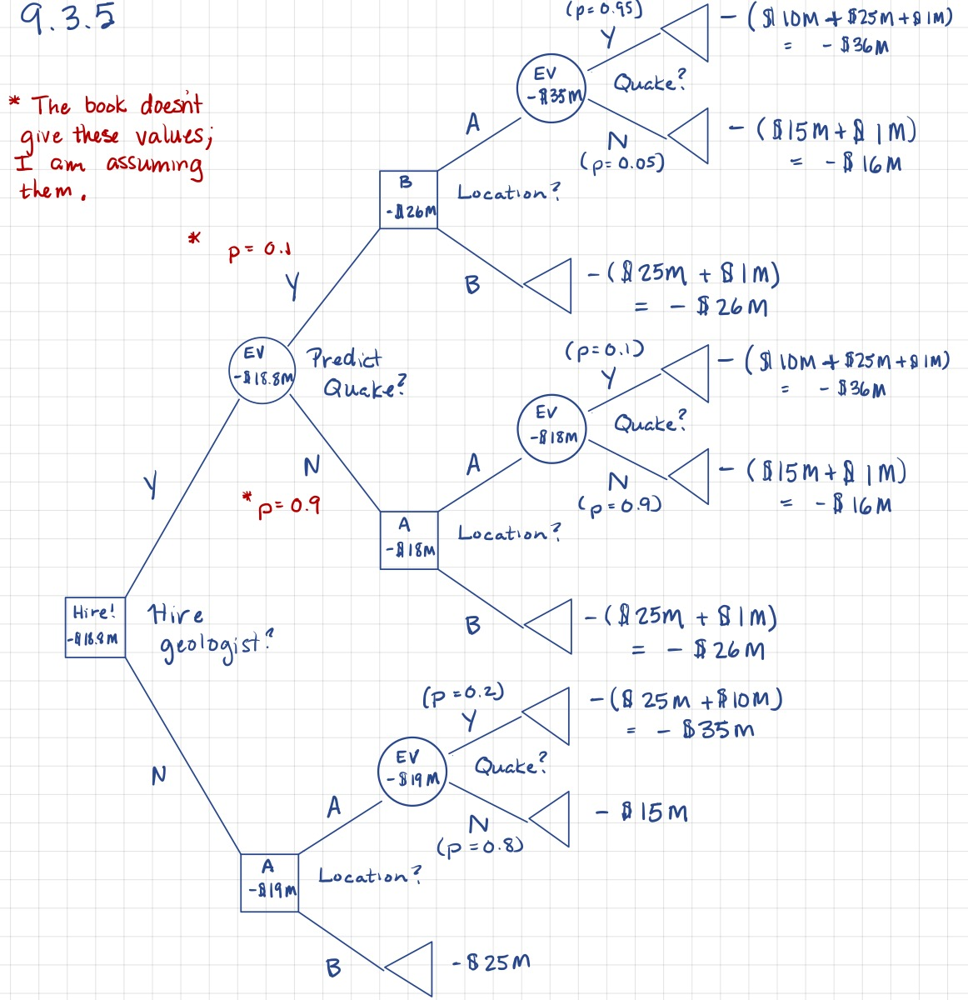

# Chapter 9

You were asked to problems 9.3.1 and 9.3.2 in the book. The problems revolve around using decision theory to decide how to play gambling game. The game is as follows:

  1. A wheel is divided into 4 sections worth \$0, \$4, \$6, and \$10. 
  2. A player is given 3 spins and may take the value on the wheel at anytime and stop.
  
In the example in the book, landing in any of the sections is equiprobable. The book argues that you should take the spin whose value exceeds the *expected* value (i.e., mean value) at the uncertainty nodes. The two problems present 2 alternative probability scenarios; I also asked you to consider some measure/criterion other than the expectation to evaluate the games.


## Problem 9.3.1

In 9.3.1 the probability of landing in the \$0, \$4, \$5, and \$10 sections are 0.23, 0.37, 0.15, and 0.25, respectively.

To find the expected value of the "spin 3" uncertainty node, we simply calculate the mean, which is:

```{r}
ev.spin3 <- sum(c(0,4,6,10) * c(0.23, 0.37, 0.15, 0.25))
ev.spin3
```
 
Next we calculate the expected value of the "spin 2" node. We do this by deciding at which sectors we stop and at which we continue to spin. If we follow the rule of "the value in hand is higher than the expected value of the next spin" rule, we would stop if a \$10 or a \$6 was the result. Thus the expected value is:
 
```{r}
ev.spin2 <- sum(c(ev.spin3,6,10) * c(0.6, 0.15, 0.25)) 
ev.spin2
```

Finally, we calculate the expected value at spin 1. We apply the same rule as before which dictates that we only accept \$10 as a result because all other outcomes are less than the expected value of spin 2. The expected value of spin 1 is:

```{r}
ev.spin1 <- sum(c(ev.spin2,10) * c(0.75, 0.25))
ev.spin1
```




### Applying Another Criteria

Let's say we don't like to play by the rules set forth in the book. What is another reasonable strategy? One might simply be to only take the maximum winning value (\$10); this is the same as a maximax strategy. If we apply this criteria we would get the following expected values:

```{r}
m.spin3 <- sum(c(0,4,6,10) * c(0.23, 0.37, 0.15, 0.25))
m.spin3
m.spin2 <- sum(c(m.spin3,10) * c(0.75, 0.25)) 
m.spin2
m.spin1 <- sum(c(m.spin2,10) * c(0.75, 0.25)) 
m.spin1
```

We can see that the expectations aren't really much different using this decision rule than the "expectation" rule. That might lead you to the question of whether one strategy is more variable than the other. Recall that given weights $w_i$, the variance is simply $V = \sum_i w_i(x_i-\bar{x})^2$. We can easily do this as well:

```{r}
vm.spin3 <- sum(c(0.23, 0.37, 0.15, 0.25) * (c(0,4,6,10)-m.spin3)^2)
vm.spin3

vm.spin2 <- sum(c(0.75, 0.25) * (c(m.spin3,10)-m.spin2)^2)
vm.spin2

vm.spin1 <- sum(c(0.75, 0.25) * (c(m.spin2,10)-m.spin1)^2)
vm.spin1
```

Compare that with:

```{r}
ve.spin3 <- sum(c(0.23, 0.37, 0.15, 0.25) * (c(0,4,6,10)-ev.spin3)^2)
ve.spin3

ve.spin2 <- sum(c(0.6, 0.15, 0.25) * (c(ev.spin3,6,10)-ev.spin2)^2)
ve.spin2

ve.spin1 <- sum(c(0.75, 0.25) * (c(ev.spin2,10)-ev.spin1)^2)
ve.spin1
```

The variances show that the using the "expectation" rule is slightly less variable than the "only take the max" (maximax) rule.

### Another criteria: maximin

Here's a quick diagram showing the maximin criteria applied to the same problem. Notice that, being the conservative strategy, we would essentially bail out as soon as we get any money back from the game. (Because there's always a chance you will lose the money in the next spin!!! PSA: Don't gamble kids.)




## Problem 9.3.2

In 9.3.1 the probability of landing in the \$0, \$4, \$5, and \$10 sections are 0.23, 0.37, 0.15, and 0.25, respectively. We repeat the above calculations using new values of both the payoffs (\$5, \$10, \$15, \$20) and probabilities (0.25, 0.35, 0.28, 0.12).

```{r}
ev.spin3 <- sum(c(5, 10, 15, 20) * c(0.25, 0.35, 0.28, 0.12))
ev.spin3
ev.spin2 <- sum(c(ev.spin3,15,20) * c(0.6, 0.28, 0.12)) 
ev.spin2 
ev.spin1 <- sum(c(ev.spin2,15,20) * c(0.6, 0.28, 0.12))
ev.spin1
```



### Alternative criterion

The expectation of the game at the beginning drops considerably from \$14.65 down to \$11.35! What about our maximax value rule?

```{r}
m.spin3 <- sum(c(5,10,15,20) * c(0.25, 0.35, 0.28, 0.12))
m.spin3
m.spin2 <- sum(c(m.spin3,20) * c(0.88, 0.12)) 
m.spin2
m.spin1 <- sum(c(m.spin2,20) * c(0.88, 0.12)) 
m.spin1
```

Yikes! This strategy is now considerably worse than the expectation rule (\$13.30 vs \$14.65). How has the variance changed?

```{r}

ve.spin3 <- sum(c(0.25, 0.35, 0.28, 0.12) * (c(5,10,15,20)-ev.spin3)^2)
ve.spin3

ve.spin2 <- sum(c(0.6, 0.28, 0.12) * (c(ev.spin3,15,20)-ev.spin2)^2)
ve.spin2

ve.spin1 <- sum(c(0.6, 0.28, 0.12) * (c(ev.spin2,15,20)-ev.spin1)^2)
ve.spin1

vm.spin3 <- sum(c(0.25, 0.35, 0.28, 0.12) * (c(5,10,15,20)-m.spin3)^2)
vm.spin3

vm.spin2 <- sum(c(0.88, 0.12) * (c(m.spin3,10)-m.spin2)^2)
vm.spin2

vm.spin1 <- sum(c(0.88, 0.12) * (c(m.spin2,10)-m.spin1)^2)
vm.spin1
```

In this case we see that the maximax rule is less variable! 


You're optimistic! Keep trying... you'll get that \$20.

## Problem 9.3.5

The figure below gives a possible decision tree for this problem. Note that the dollar amounts are negative because we're dealing with costs, which we want to minimize; by writing of them as negative quantity, we can just apply our usual maximization logic. (In other words, the maximum negative value is the minimum cost.)



This problem is missing some information, namely the probability of the geologist predicting an earthquake at site A. In the figure, I just assumed a 90\% chance that they predict "no earthquake." We can clearly solve for where the break point is by solving $18p +26(1-p)=19$ which yields $p=0.875$. So, if the chance that the geologist predicts "no earthquake" is greater than 0.875, we would opt for hiring the geologist. 

