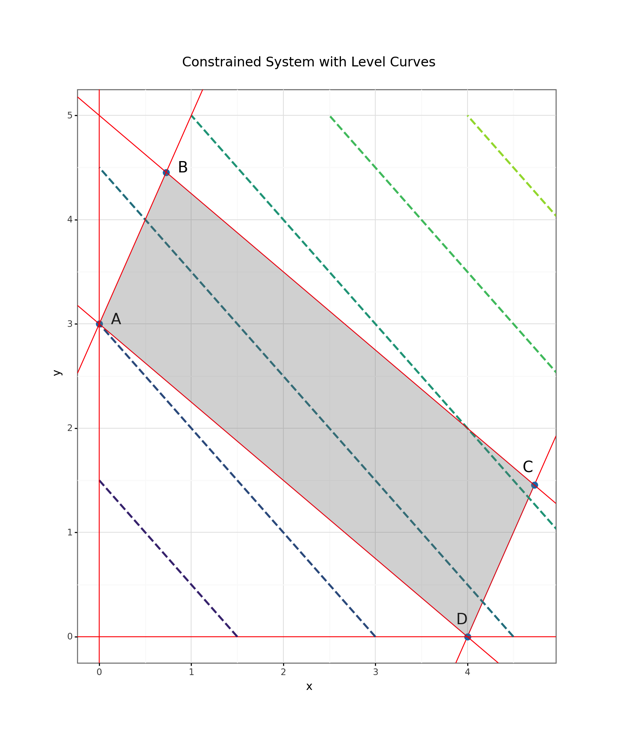

```{r include=F}
knitr::opts_chunk$set(message = F, warning = F)
library(igraph)
```

**SUPER IMPORTANT:** Your exam is due by 11:59:59.9999 p.m. Monday the 11th as an Rmd file.

# Problem 1 (20 pts.)

The town of Springfield is a buzz with gossip about Mayor Quimby's scandalous lifestyle! Careful research using various social media platforms has revealed the communication network between Springfield's most important citizens to be the following:

```{r, echo=F, fig.width = 6}
set.seed(5019)
g <- erdos.renyi.game(10, 25, type="gnm", directed = T)
E(g)$weight <- rpois(25,3.1)
g <- set_vertex_attr(g, "name", value = c("Bart", "Lisa", "Maggie", "Homer", "Marge", "Ned", "Smithers", "Moe", "Burns", "Skinner"))
plot(g, layout=layout.circle, vertex.size = 30, vertex.color = "white")
```
 
 Furthermore, the edges of the network have weights given by the adjacency matrix:
 
```{r, echo=F, warning=F, message=F}
 as_adjacency_matrix(g, attr="weight")
```
 
Armed with this information, answer the following questions:

1. Assuming the edge weights represent the capacity to spread gossip
    + determine maximum amount of gossip that gets from Maggie to Smithers,
    + plot the path through which the gossip flows, and
    + determine what percentage of Maggie's gossip reaches Smithers.
    
2. Now assuming that the edge weights instead reflect the distance between vertices
    + find each character's most distant gossip partner(s),
    + find each character's nearest gossip partner(s), and
    + the citizens of Springfield decide to play a game of telegraph, but the goody-two-shoes Lisa and Ned don't want to play; what is the minimal distance required to pass the telegraph throughout the remaining network?   
  
3. Is there a closed walk (i.e., starts and stops at the same vertex) that traverses every edge of the graph only once? Explain why or why not. (*Hint:* this is the same question as the seven bridges of K&ouml;nigsberg.)

__________________________________
  
# Problem 2 (20 pts.)

A farmer has 30 acres on which to grow tomatoes and corn. Every 100 bushels of tomatoes requires 1000 gallons of water and 5 acres of land. Every 100 bushels of corn requires 6000 gallons of water and 2.5 acres of land. Labor costs are \$1 per bushel for both crops. The farmer has 30000 gallons of water and \$750 to plant his crops. He also knows he cannot sell more than 500 bushels of tomatoes or 475 bushels of corn. He earns \$2 per bushel of tomatoes and \$3 per bushel of corn. 
  
  1. How many bushels of each crop should he raise to maximize his profits?
  2. Should the farmer sign a contract where he must deliver **at least** 300 bushels of tomatoes and **at least** 500 bushels of corn? Defend your answer.
  3. Assume the farmer can buy 10000 gallons of water for \$50. Should he do this? Defend your answer.

__________________________________
  
# Problem 3 (20 pts.)

It's snowing in Moscow!!! (Well, not really, but Prof. Ridenhour keeps hoping...) Unfortunately, due to some real poor financial management and modeling abilities, the UI administration has put the university into dire straits. Now, there's no money left to remove any snow from the sidewalks of our fair campus. **Not to worry!!!** Due to some brilliant brainstorming, the administration has decided to assign 1000 students to do snow removal prior to 8 a.m. every morning. Students are randomly assigned to pairs every morning and given a pathway to shovel. If both students in the pair go out and shovel, they each receive a payoff of 200 international happiness units (IHU) because they can walk to class with rather minimal effort. However, some of the assignees figure out that if you just sleep in, the other will take care of it; these cheaters receive a payoff of 300 IHU! Unfortunately, the flip side of this is that the honest hard worker only gets 100 IHU. If everyone sleeps in, the sidewalks are impassable and there is a payoff of 0 IHU, because no one can get to their cherished classes. If someone used a particular strategy in the prior day, then they will stick with that strategy if they didn't have a better option (i.e., players will unilaterally switch to a better strategy).  It looks like it will be a doozie of a winter, with 100 days of continuous snow in the forecast (again, wishful thinking on the prof's part). Winter is coming... 

1. What are the Nash equilibria of this game?
2. Using a Markov chain approach, write down the recursion equations for both shovelers and sleepers.  Assume that 10\% of the students are lazy to start off with and simulate the system. Plot the dynamics of the system. What percentage of the students are sleepers at the end of the winter? Plot the average payoff in the system over time.  What is the average payoff in the system at the end of the winter? Is this what you expected? Where does the maximal payoff for the system occur? What does this mean in terms of what a player **should** do?
    + Repeat the simulation using a starting point of 90\% lazy students!!! (I'm not judging...) Does the initial condition matter? (i.e., is the solution stable?)
3. Now let's assume that players **do not necessarily act rationally**. Add a coefficient &alpha; that represents entrenchment (stubbornness), such that if  &alpha;=0 no-one ever changes their strategy, and if &alpha;=1 players return to rationality. Also assume that players **stochastically** obey their entrenchment (some days you feel like a nut, some days you don't!). Vary &alpha; from 0 to 1 and make a plot of average payout and its standard deviation versus &alpha;. Use the last 15 days of winter to calculate these statistics. Include two starting conditions (90\% shovelers, 10\% shovelers) on the plot. Interpret your plot!
    + Repeat the previous exercise but with two versions of &alpha; that allow different levels of entrenchment for shovelers and sleepers (hey, who doesn't like sleeping in?). Make a heatmap of the average payoff with level curves versus the two parameters. (*NB:* You will need two heatmaps for the two initial conditions.)  
    
    
________________________________

# Problem 4 (5 pts.)

Using the the decision tree below, apply the listed criteria to answer the following:

  1. Maximum expected value: GAME = ?? ; EXPECTED VALUE = ??; MAX WINNINGS = ??; MAX LOSSES = ??
  2. Maximin: GAME = ?? ; EXPECTED VALUE = ??; MAX WINNINGS = ??; MAX LOSSES = ??
  2. Maximax: GAME = ?? ; EXPECTED VALUE = ??; MAX WINNINGS = ??; MAX LOSSES = ??


________________________________

# Problem 5 (5 pts.)

We can solve the team (softball, basketball, etc) manager's problem using multiple techniques. Two of those techniques are looking for a maximal matching set of a graph and determining the maximum flow of a directed graph. Give a written explanation of both techniques. When you execute either technique how do you know if you have a solution to the manager's problem? Because there can be many solutions to the manager's problem, how can we explore the solution space in R/Python to find other solutions?

________________________________

# Problem 6 (5 pts.)

In class, we used Gillespie's 1976 algorithm, as well as the $\tau$-leaping version of the algorithm (Cao, Gillespie and Petzold; 2006). Briefly describe the difference in the underlying logic of the two algorithms. Why/when is it favorable to use $\tau$-leaping? What does the parameter $\epsilon$ do in the $\tau$-leaping algorithm? 

________________________________

# Problem 7 (5 pts.)

Using the following plot of a constrained linear system that we wish to optimize, answer the following questions.


  
  1. If we start at the point A, what path will the Simplex algorithm take if we want to **maximize** the objective function? Blue colored contours are lower values of the objective function. Write your answer as: First Point $\rightarrow$ Second Point $\rightarrow$ ... $\rightarrow$ Stop Point.
  2. If we start at the point C, what path will the Simplex algorithm take if we want to **minimize** the objective function?

________________________________

# Improve class! (5 bonus pts.)

I have two questions that I am looking for feedback on. Suggestions are appreciated! `r emo::ji("smile")`

  1. First, I am considering possibly changing books for the course. Did you like the Giordano, et al. book? Specifically, I am interested in (a) was it difficult/easy to read and (b) the content of the book. My specific concerns are that we cover a lot of topics at not a lot of depth (though this is to be expected somewhat for an introductory math modeling course) and that it's pretty useless from a computational viewpoint. 
  2. Would you prefer the course to be TR course versus a MWF course? My motivation for potentially having a longer class would be to discuss topics and homework, have group discussions, and work on R code. I am curious to know what you think about the longer class periods and the oddity (?) of a non-MWF math class (would that fit in your schedules?).


