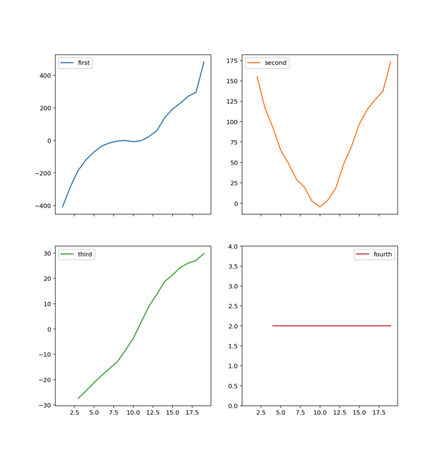
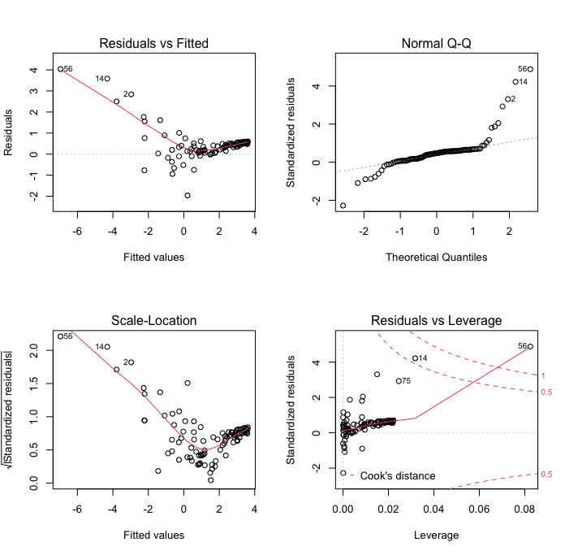

**IMPORTANT:** In problem 2 please set a random seed so that your results are reproducible.

**SUPER IMPORTANT:** Your exam is due by 5:00 p.m. Friday the 13th as an Rmd file uploaded on Canvas.

# Problem 1 (25 pts.)

Ol' Doc Ridenhour is droning on again about the wonders of math in an 8:30 a.m. Calc 3 class. You, and most of your classmates, barely got any sleep last night; you look over your shoulder and see your friend has already succumbed to the sandman, and others nearby are close as well. From a biology class you took, you remember the average length of a nap is 15 minutes; once awake again, people are unlikely to fall asleep for many hours. You also recall that sleep (like yawns) spreads through a crowd as a diffusion process and depends **proportionally** on the square root-concentration of people that are asleep.

 1. Write down a system of **difference** equations that describes the dynamics of students sleeping in Calc 3.
 2. Based on your equations, under what condition does the number of sleeping students increase during the period?
 3. Using one minute time steps, and assuming that one student is asleep at the very begginning of class (Billy), iterate the system of equations for a 50 minute class of 70 students. Assume the proportionality constant to be 0.02.
  - Plot the resulting data for both awake and asleep students.
  - Vary the constant of proportionality some (pick 2 more values); iterate and plot the results.
 4. According to your model (with the originally assumed proportionality constant), what is the probability that you fell asleep during the lecture?
 5. How many students would you expect to still be asleep at the end of the lecture?
 6. When does the maximum number of students that are asleep occur? (*Hint:* Make sure you check times longer than 50 minutes if your number of sleeping students is still increasing at 50 minutes.)
 7. You decide that it is necessary to fit a model to actual data. While diligently staying awake, you observe when each new individual falls asleep and the total number asleep at that time. For your model, fit the proportionality constant by using optimization based on the *median absolute deviation*, the Brent algorithm, and the following data:

```{r, echo = F}
sleepers <- data.frame(Minutes = c(5, 7, 10, 12, 14, 16, 18, 20, 21, 23, 25, 27, 28, 30, 32, 33, 35, 37, 39, 41, 42, 44, 46, 48), Asleep = c(2, 2, 3, 4, 4, 5, 5, 6, 6, 6, 6, 7, 7, 7, 7, 7, 8, 8, 8, 8, 8, 8, 8, 8))
knitr::kable(sleepers)
```

 8. Repeat the optimization two more times but using first the Chebyshev criteria and second a log-likelihood criteria based on a Poisson distribution.
 9. Plot the fitted models in 7 & 8 versus the observed data.

# Problem 2 (25 pts.)

{width=400px}

Hrothgar, a level 6 half-dwarf warrior, has wandered into the lair of the evil drow elf Grimweard, a level 8 mage. A battle to the death ensues! Fortunately, **our hero got an A in MATH 438** and can figure out what his chances of surviving the harrowing encounter are. Hrothgar is attacking Grimweard with a rather sad club that does 1d6 damage, and, given that he is rather inexperienced, he must roll >11 on 1d20 to actually hit Grimweard; should he roll >17, he gets lucky and gets double the damage. He also has 25 hit points. In comparison, his foe is casting a magic missile spell that does 2d4 damage and requires >6 on 1d10 to hit our hero. Grimweard is weaker and only has 15 hit points. Assume that who attacks first is chosen at random. Based on 1000 simulated battles between Hrothgar and Grimweard, answer the following:

  1. Using an empirical cumulative distribution function (eCDF), create a random number generator that takes a single argument ($n$), that returns $n$ random amounts of damage done by Hrothgar. Do this for Grimweard as well. Make 2 histograms using these RNGs by setting $n = 1000$.
  2. What percentage of the time does Hrothgar defeat Grimweard?
  3. How many turns, on average (mean and median), does it take Hrothgar to defeat Grimweard? What is the 95% CI?
  4. How many turns, on average (mean and median), does it take Grimweard to defeat Hrothgar? What is the 95% CI?
  5. Assume that the battle does not need to be to the death, but that Hrothgar can decide to flee the battle below some threshold. Once Hrothgar decides to flee, Grimweard is allowed to attack him one last time. Search for an optimal threshold where fleeing improves Hrothgar's chance of survival, but does not affect his chance of winning much. Create a table that has 3 pieces of information: the threshold at which Hrothgar flees, the percentage of the battles he wins, and the percentage of times that fleeing prevented dying (i.e., Hrothgar fled and Grimweard did not manage to kill him with his last attack). 
  6. What would you recommend Hrothgar do?


# Problem 3 (5 pts.)

Examine the following plots of divided differences. Based on the plots, do you think there is an obvious polynomial order with which to fit the underlying data? Explain your answer!!

{width=600px}

# Problem 4 (5 pts.)

Given the points (0,2), (1,5), (2,1), write out the **unsimplified** Lagrange polynomial (i.e., do not try to simplify the sum or the fractions). After you have written down the polynomial, evaluate the polynomial **by hand** at $x = 3$.

# Problem 5 (5 pts.)

Derive the inverse CDF that could be used to generate random numbers distributed according to $p(x) = 3 x^2 + 5$ on the interval $x \in [1,4]$. Use R to generate 1000 random numbers from this CDF and plot the resulting histogram (use 50 bins). 

# Problem 6 (5 pts.)

Examine the following diagnostic plots produced after a fitting a linear model to some data. Discuss any issues you observe for EACH of the 4 panels. Would you be happy with model based on these diagnostics? How might you fix/improve the model?

{width=600px}

# Problem 7 (5 pts.)

What are the two main categories of models that we have discussed in class? Discuss the strengths and weaknesses of both types of models. Give an example of each type of model.
